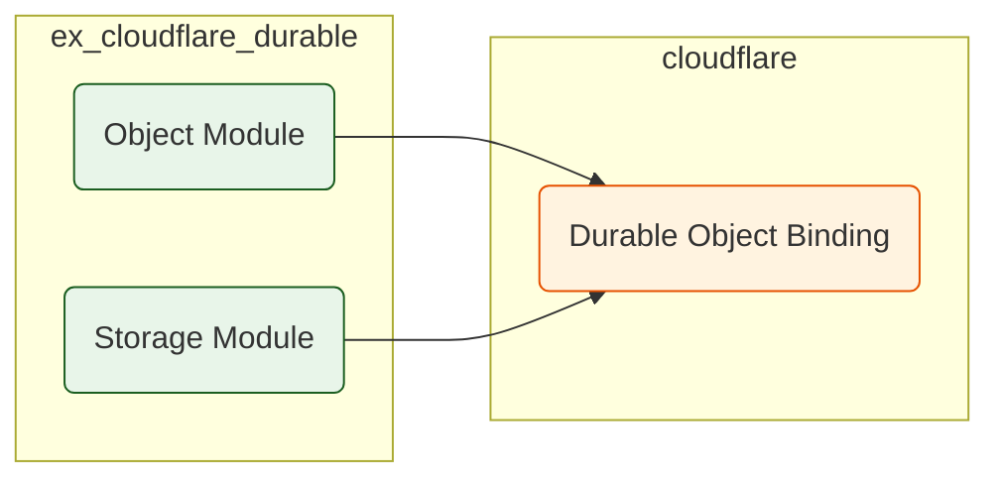

# ExCloudflareDurable

**TODO: Add description**

## Installation

If [available in Hex](https://hex.pm/docs/publish), the package can be installed
by adding `ex_cloudflare_durable` to your list of dependencies in `mix.exs`:

```elixir
def deps do
  [
    {:ex_cloudflare_durable, "~> 0.1.0"}
  ]
end
```

Documentation can be generated with [ExDoc](https://github.com/elixir-lang/ex_doc)
and published on [HexDocs](https://hexdocs.pm). Once published, the docs can
be found at <https://hexdocs.pm/ex_cloudflare_durable>.

**1. `ex_cloudflare_durable` Architecture:**



**Discussion:**

`ex_cloudflare_durable` is another low-level library, but instead of focusing on the Cloudflare Calls API, its focus is on simplifying interactions with Durable Objects using the Elixir API.

The **`Object` module** serves as the entry point to interact with DO namespaces providing the ability to directly fetch the durable object by name from the cloudflare runtime.

The **`Storage` module** has a clean functional API for reading/writing to the Durable Object's storage.

The goal here is to separate the responsibility for interacting with the Durable Objects from higher-level features, offering only the low-level APIs for using DO functionality. These operations are stateless, which is why no supervision tree is created in this module. This design pattern also supports reuse and extensibility of the module, allowing other higher level packages to integrate with it, without requiring a specific implementation. This allows for the core module to stay light-weight and focused on its core concerns.

 